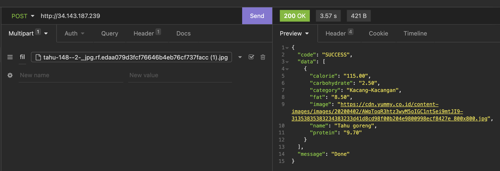

# ML Deployment

This is repository for our Machine Learning Deployment using Tensorflow and running on Docker.

The package we use is :
- Tensorflow for machine learning
- Flask for API Web Framework

## Pre-requisite
Have Docker pre installed and running on AMDx64 machine, M1 currently not supported
## How to use

1. Clone tensorflow/mdoels repo
```
git clone https://github.com/tensorflow/models
```
2. enter this command
```
docker-compose up
```
3. The API will be serve in port 80
<div align="center">
  <a href="https://github.com/github_username/repo_name">
    
  </a>


</div>